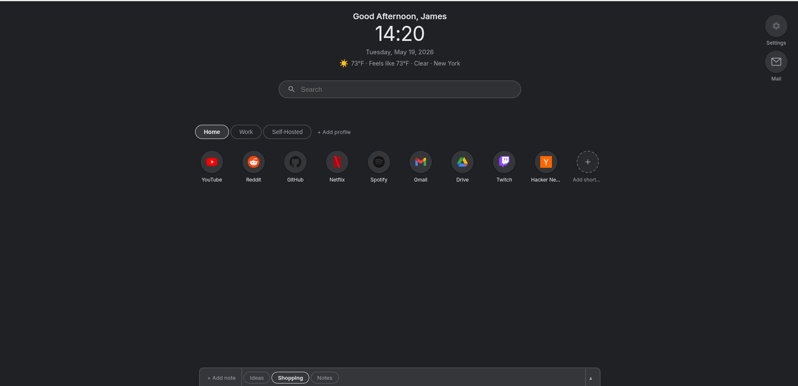
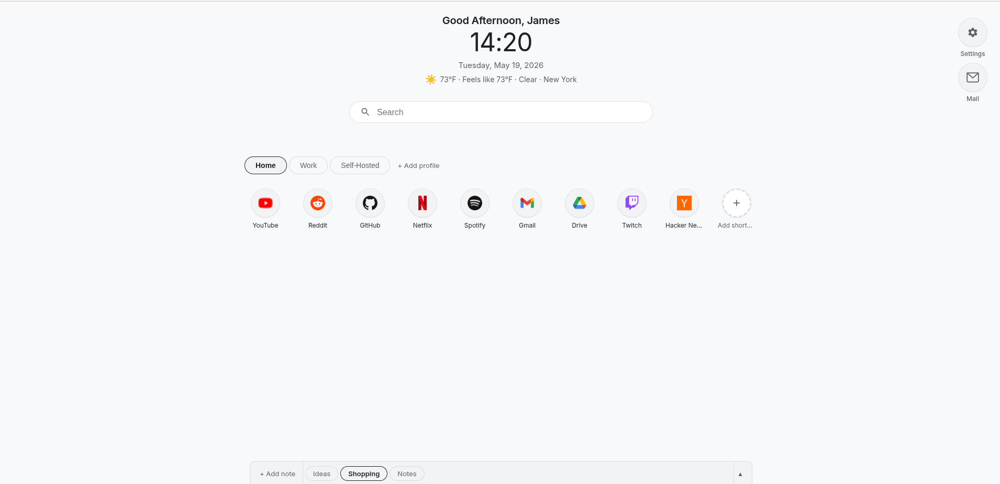
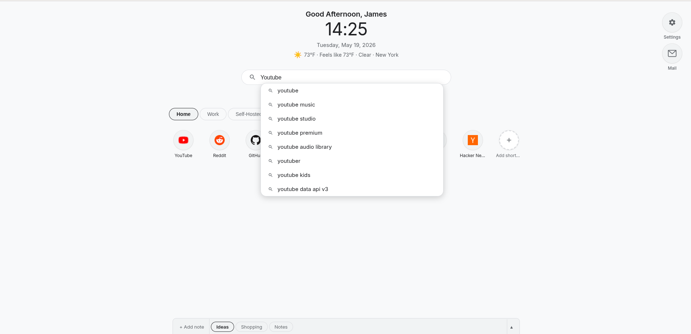
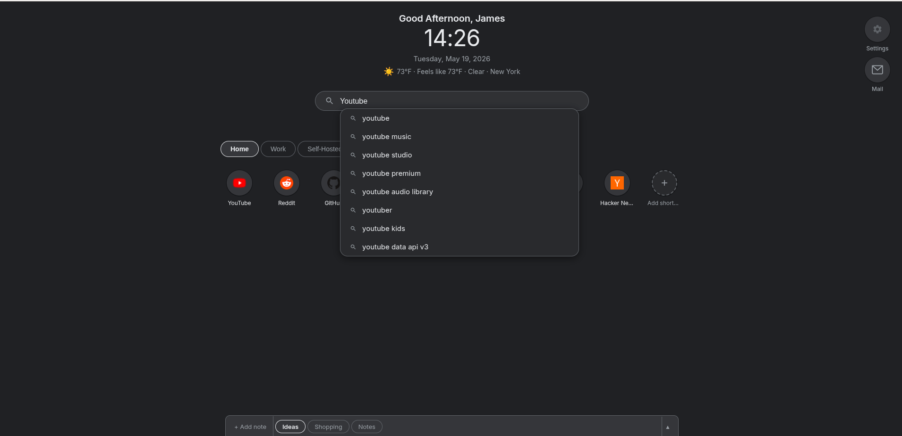
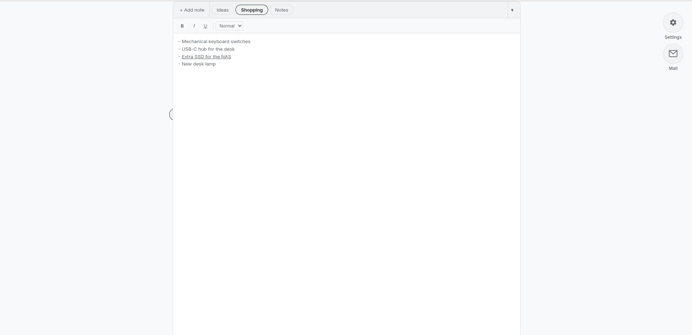
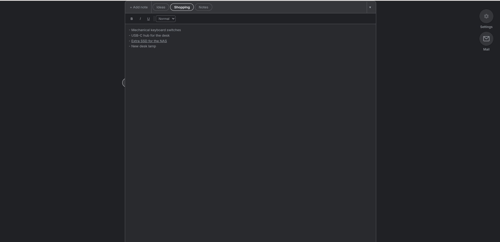
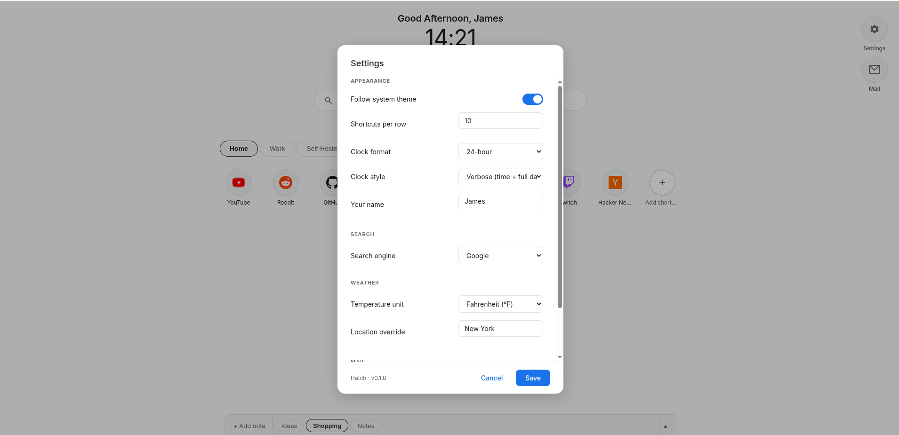
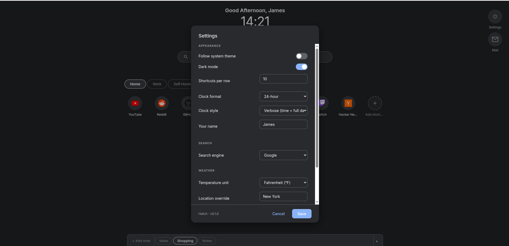
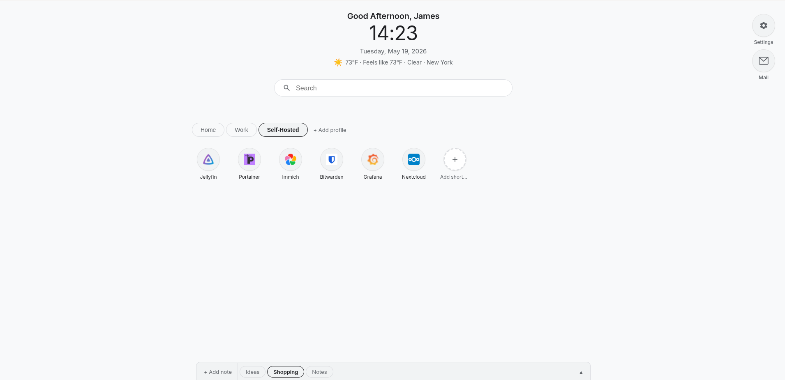
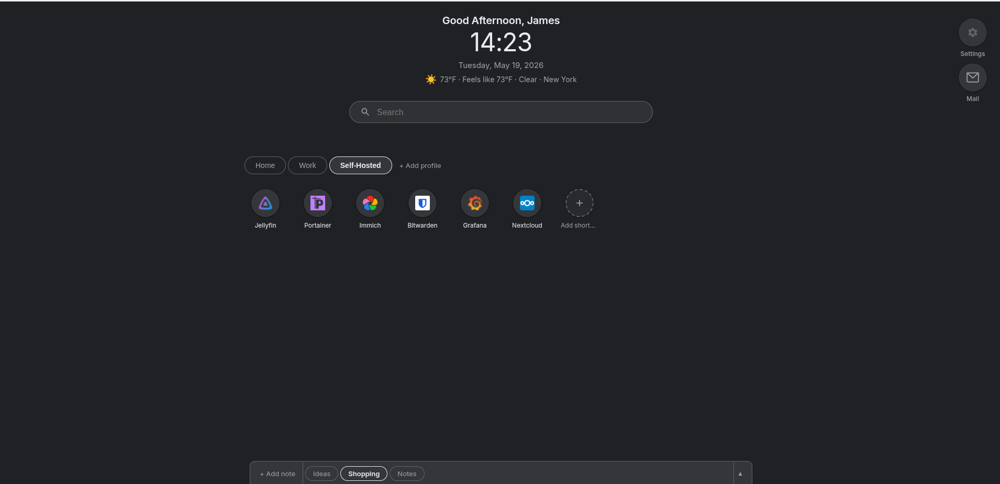

<p align="center">
  
</p>

<p align="center">
  A clean, self-hosted start page that feels like home.<br>
  The familiar search-and-shortcuts layout you already know — but yours to configure,<br>
  with no accounts, no cloud, and your data staying on your own server.
</p>

---



## Features

- **Shortcuts** — organise your most-visited sites into profiles, drag to reorder, right-click to edit
- **Search** — live suggestions as you type, choose your engine (Google, DuckDuckGo, Brave, Bing)
- **Notes** — rich text notepad with multiple tabs, always one click away
- **Weather** — current conditions via Open-Meteo, auto-detects your location or set a city manually
- **Clock & greeting** — time, date, and a personal greeting with your name
- **Profiles** — multiple shortcut profiles, switch with one click
- **Dark mode** — follows your system theme automatically, or set it manually
- **Password protected** — simple token-based auth, set your password in the compose file
- **Favicon proxy** — automatically fetches icons for your shortcuts
- **Self-hosted friendly** — works great over Tailscale or Cloudflare Tunnel

## Quick Start

> **New to Docker or need help setting Hatch as your new tab page?** See the [full setup guide](SETUP.md).

```yaml
services:
  hatch:
    image: ghcr.io/johannes1202/hatch:latest
    restart: unless-stopped
    ports:
      - "7575:8000"        # change 7575 to your preferred port
    volumes:
      - hatch_data:/data
    environment:
      - HATCH_PASSWORD=changeme  # change this to a secure password

volumes:
  hatch_data:
```

Save as `docker-compose.yml`, then:

```bash
docker compose up -d
```

Open `http://localhost:7575` in your browser. That's it.

## Configuration

| Variable | Default | Description |
|---|---|---|
| `HATCH_PASSWORD` | `changeme` | Password to access the app |
| Port (left of `:8000`) | `7575` | The port Hatch listens on |

Everything else — search engine, weather location, clock format, dark mode, name — is configurable from the settings panel inside the app.

## Accessing Remotely

Hatch works great over [Tailscale](https://tailscale.com) or [Cloudflare Tunnel](https://developers.cloudflare.com/cloudflare-one/connections/connect-networks/). Deploy it on any machine on your network and access it from anywhere via your Tailscale IP or tunnel URL.

## Screenshots

| | Light | Dark |
|---|---|---|
| **Home** |  |  |
| **Search** |  |  |
| **Notes** |  |  |
| **Settings** |  |  |
| **Self-Hosted** |  |  |

## Building from Source

```bash
git clone https://github.com/Johannes1202/hatch.git
cd hatch
docker compose up -d --build
```

## License

MIT — do whatever you want with it.
